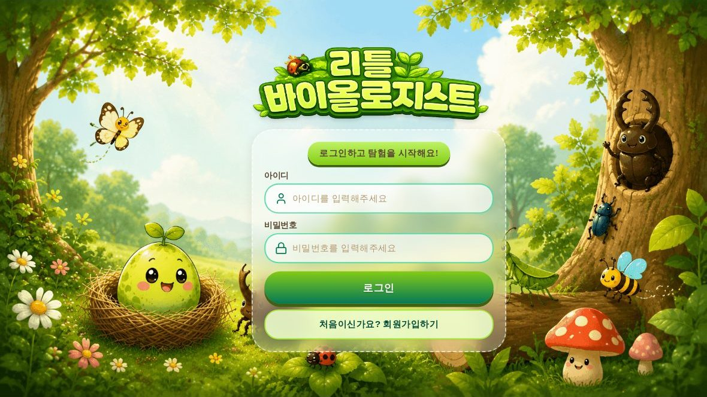
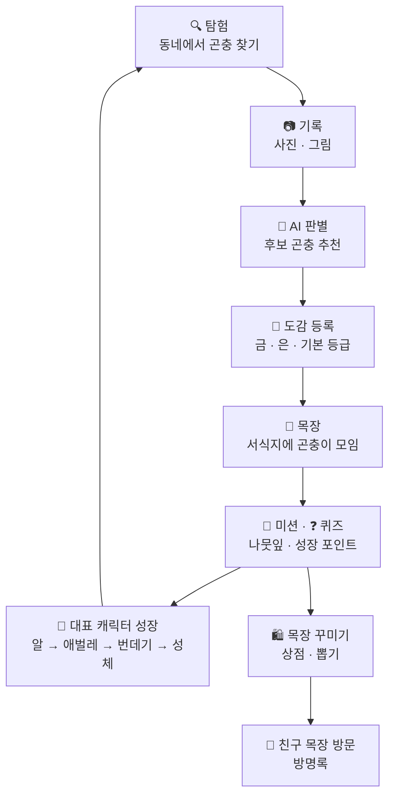
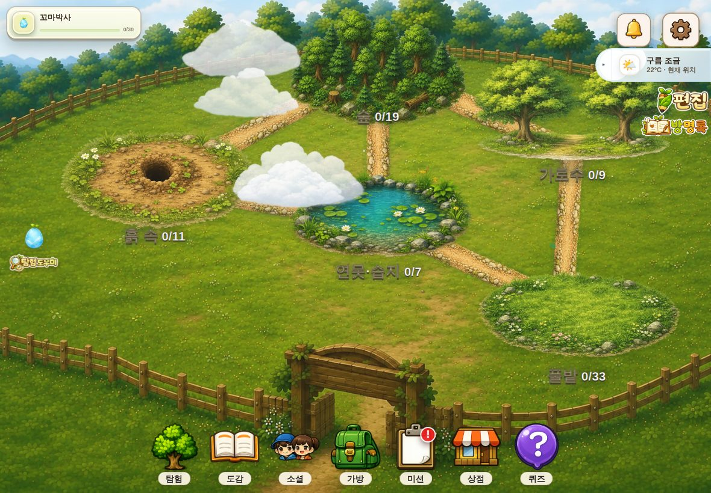
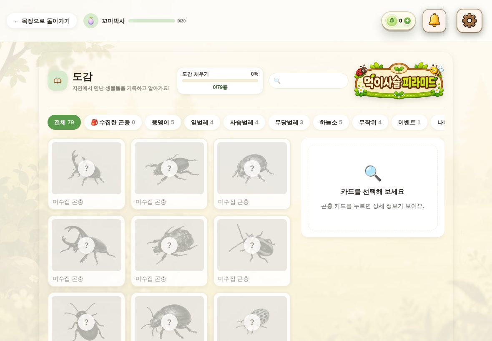
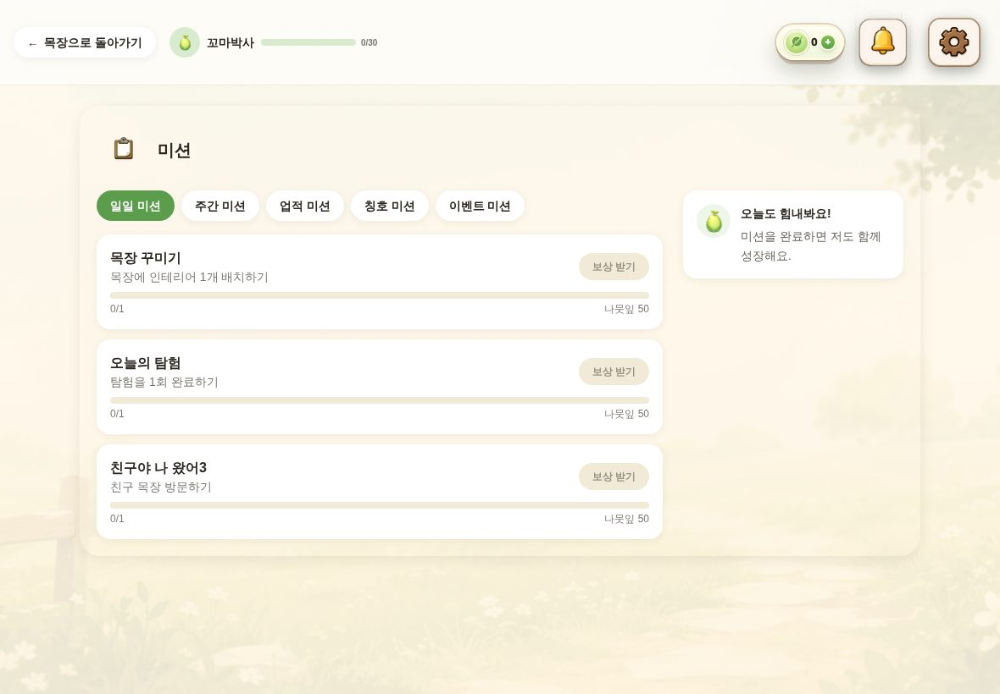
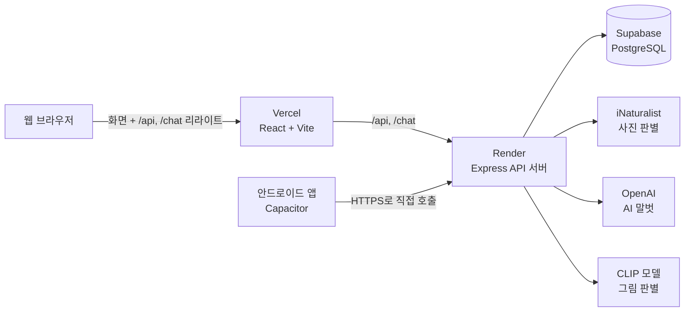

<div align="center">

# 🌿 리틀 바이올로지스트 (Little Biologist)

**동네에서 만난 곤충을 사진이나 그림으로 기록하면 AI가 이름을 찾아 주고,<br/>나만의 도감과 목장이 함께 자라나는 어린이 생태 탐구 게임**

[▶ 웹에서 플레이](https://little-biologist2.vercel.app) · [📱 안드로이드 앱](#안드로이드-앱) · [📝 개발 기록](docs/devlog/) · [⚙️ 설치·배포 가이드](SETUP.md)



</div>

## 어떤 서비스인가요?

리틀 바이올로지스트는 **아이가 주도하는 생태 탐구**를 게임으로 만든 서비스입니다.

- **대상**: 곤충과 자연에 호기심이 많은 어린이
- **핵심 아이디어**: 정답을 바로 알려 주기보다 **직접 관찰하고 기록하는 경험**을 먼저 만듭니다.
  - 아이가 밖에서 찾은 곤충을 사진이나 그림으로 남기면 AI가 어떤 곤충인지 후보를 찾아 줍니다.
  - 등록한 곤충은 도감에 쌓이고, 목장의 서식지에 모여 살며, 퀴즈와 미션으로 다시 이어집니다.
- **안전 원칙**
  - 짧고 따뜻한 아동 친화적 말투를 씁니다.
  - 개인정보를 묻지 않습니다.
  - 위험한 곤충 접촉을 권하지 않습니다. 위험한 질문은 AI 말벗이 안전 안내로 바꿔 답합니다.

## 플레이 흐름



## 주요 기능

| | 기능 | 내용 |
|---|---|---|
| 🏡 | **목장 (홈)** | 숲·풀밭·가로수·연못·습지·흙 속, 5개 서식지가 있는 나만의 목장. 실제 날씨에 맞춘 비·눈·안개 효과, 드래그·확대, 인테리어 배치. 반짝이 곤충이 하루 최대 3번 나타남 |
| 🔍 | **탐험** | 사진은 iNaturalist 컴퓨터 비전이 후보를 추천. 그림은 CLIP 모델이 판별하고, 아이가 고른 특징(날개·색·무늬 등)으로 결과를 보정. 따라 그리기, 동네 생태 지도(최근 1년·반경 3km 관찰 기록) |
| 📖 | **도감** | 79종(숲 19·풀밭 33·가로수 9·연못·습지 7·흙 속 11)을 20개 분류로 보기. 등급은 **금**(직접 찍은 사진)·**은**(직접 그린 그림)·**기본**. 먹이사슬 피라미드 |
| 🥚 | **대표 캐릭터** | 계정마다 배정되는 알이 성장 포인트 10점마다 한 단계씩 애벌레 → 번데기 → 성체로 자람 |
| 🎯 | **미션·칭호** | 일일 3개(후보 12개 중 매일 바뀜), 주간 3개, 업적 30개, 칭호 30개. 보상은 나뭇잎과 성장 포인트 |
| ❓ | **퀴즈** | 하루 한 번, 내가 등록한 곤충으로 3문제. 정답 하나마다 성장 포인트 10 + 나뭇잎 200 |
| 👫 | **친구** | 친구 ID로 검색·요청, 친구의 목장과 도감 구경, 방명록 |
| 🛍️ | **상점·가방·뽑기** | 나뭇잎으로 인테리어(기본·바다·겨울 테마)와 가방 확장권 구매. 뽑기는 1회 나뭇잎 200개이고 모든 아이템이 같은 확률 |
| 💬 | **AI 말벗** | 내 대표 캐릭터나 도감 속 곤충과 대화. 캐릭터 말투를 유지하고, 위험한 질문은 안전 안내로 전환 |
| 🧭 | **튜토리얼** | 처음 가입하면 10단계로 목장·도감·탐험·미션·가방을 안내 |

| 목장 | 도감 | 미션 |
|---|---|---|
|  |  |  |

## AI는 이렇게 쓰여요

| 쓰임 | 기술 | 설계 포인트 |
|---|---|---|
| 사진 판별 | iNaturalist Computer Vision API | 토큰을 숨기려고 항상 서버를 거쳐 호출. 24시간마다 만료되는 JWT를 서버가 자동으로 갱신 |
| 그림 판별 | CLIP(`Xenova/clip-vit-base-patch32`), Transformers.js로 서버에서 실행 | 아이 그림은 색·질감 정보가 부족해서, 아이가 고른 특징 힌트로 후보를 거르고 보정 |
| AI 말벗 | OpenAI(기본 `gpt-4o-mini`) | 시스템 프롬프트와 API 키는 서버에만 둠. 개인정보 질문 금지, 위험한 표현은 서버에서 한 번 더 거름 |

## 기술 구성



| 영역 | 사용 기술 |
|---|---|
| 프론트엔드 | React 18, Vite 5, React Router 6, Tailwind CSS 3, Framer Motion |
| 앱 | Capacitor 8 (Android). 웹과 같은 코드를 그대로 사용 |
| 백엔드 | Node.js 22, Express 4, Multer, Sharp |
| 데이터베이스 | Supabase (PostgreSQL) |
| 외부 API·AI | iNaturalist, OpenAI, Transformers.js(CLIP), Open-Meteo(날씨), Google Maps JavaScript API |
| 배포·자동화 | Vercel(웹), Render(API 서버), GitHub Actions(안드로이드 APK 빌드) |

## 실행 방법

### 웹

```bash
npm install
cp .env.example .env   # 값 채우기 (SETUP.md 2번 참고)
npm run dev            # 웹 http://localhost:5173 + API 서버 5174를 함께 실행
```

### 안드로이드 앱

- **APK 바로 받기**
  1. GitHub의 [Actions → Android 디버그 APK](https://github.com/bobo33772-blip/little-biologist2/actions/workflows/android-apk.yml)에서 가장 최근 실행을 엽니다.
  2. **Artifacts**에서 `app-debug.apk`를 받아 폰에 설치합니다. 폰에서 "출처를 알 수 없는 앱 설치"를 허용해야 해요.
- **직접 빌드**: Android Studio를 설치한 뒤 `npm install` → `npm run app:android` → ▶ Run.
- 자세한 방법은 [SETUP.md 7. 안드로이드 앱 빌드](SETUP.md#7-안드로이드-앱-빌드)를 보세요.

## 폴더 구조

```text
src/
  api/              서버·외부 API 호출 (base.js: 웹/앱 서버 주소 분기)
  components/       공통 UI(common)와 기능 컴포넌트(features)
  context/          나뭇잎·가방·미션·튜토리얼 등 전역 상태
  data/             곤충 79종·서식지·미션·칭호 데이터
  pages/            화면 단위 컴포넌트 (라우트와 1:1)
  router/           로그인 상태와 보호 라우트
  utils/            사운드, 웹/앱 판별 등
server/             Express API 서버 (Render 배포)
android/            Capacitor 안드로이드 프로젝트
public/             최적화된 이미지·사운드 (WebP 등)
docs/devlog/        개발 기록: 기능별로 "왜 이렇게 했는지"
prompts/            서비스 정체성·기능별 AI 프롬프트·디자인 원칙
scripts/            DB 기준 데이터 시드, 이미지 최적화, iNaturalist 토큰 발급, 그림 분류기 학습
training/           그림 판별용 아동 그림 학습 데이터 안내
IMAGE/ 목장/ 소리/   원본 디자인·사운드 에셋 (일부는 빌드 때 바로 가져다 씀)
app.js, styles.css  초기 프로토타입 (현재 서비스 코드는 src/)
```

## 문서

- [SETUP.md](SETUP.md): 환경변수, 배포(Vercel·Render·Supabase), 운영 메모, 안드로이드 앱 빌드
- [docs/devlog/](docs/devlog/): 개발 기록 (포트폴리오용, 기능마다 배경·대안·결정 이유·검증)
- [prompts/](prompts/): 서비스 정체성, 기능별 AI 프롬프트, 디자인 원칙
- [CLAUDE.md](CLAUDE.md): AI 코딩 도우미가 따르는 작업 규칙

## 현재 상태와 다음 계획

- ✅ 웹 서비스 운영 (Vercel + Render + Supabase 무료 플랜)
- ✅ 안드로이드 앱 1차 전환: 서버 연결, 로그인 유지, 가로 고정, 뒤로가기, APK 자동 빌드 ([기록 001](docs/devlog/001-web-to-android-app.md))
- ⏳ 앱 다듬기: 카메라로 바로 촬영, 백그라운드 음악 정지, 아이콘·스플래시, 전체화면
- ⏳ 스토어 출시 준비: 회원 탈퇴, 개인정보처리방침, 방명록·AI 답변 신고, API 인증 강화
- ⏳ iOS 앱 (Mac과 Xcode 필요)

## 개발 메모: 에셋

- **곤충 도감 이미지**
  - `public/insects/{2자리 ID}.webp`에 있습니다.
  - 원본 PNG(평균 870KB, 총 70MB)를 최대 640px, WebP 품질 82로 줄여 약 1.9MB가 됐습니다.
- **목장 이미지**
  - `public/ranch/background.webp`가 배경이고, 서식지 오브젝트 5장이 그 위에 올라갑니다.
  - 서식지 위치는 `src/data/insectSpecies.js`의 `HABITATS` 배열 `x`/`y`(퍼센트)로 조정합니다.
- **서식지 분류**: 정식 분류학 기준이 아니라 이 게임을 위해 정한 분류입니다(숲·풀밭·가로수·연못·습지·흙 속).
