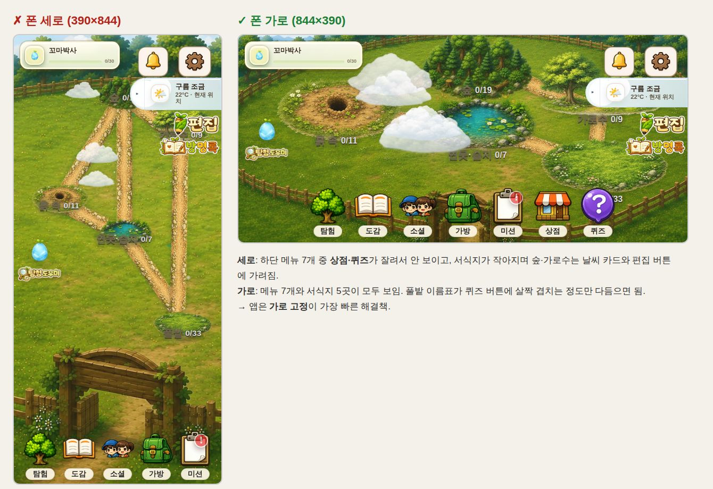

# 001. 웹 게임을 안드로이드 앱으로 전환

- 날짜: 2026-10-04
- 분류: 플랫폼 확장
- 계기: 처음부터 앱으로 만들고 싶었지만 웹(React + Vite)으로 먼저 완성했다. 이제 폰에서 앱으로 설치해 플레이할 수 있게 하고 싶다.
- 관련 커밋
  - `1bc5d48` feat(app): make API calls and login work inside a native app shell (1단계)
  - `15349e6` feat(app): add Capacitor Android project with landscape lock and back button (2단계)

## 1. 배경

리틀 바이올로지스트는 웹으로 완성되어 다음처럼 운영되고 있었다.

- 프론트엔드: Vercel (React 18 + Vite 5)
- 백엔드: Render (Express)
- DB: Supabase (PostgreSQL)

목표는 **이미 만든 게임을 다시 만들지 않고** 폰에 설치하는 앱으로 플레이하는 것이었다.

## 2. 검토한 선택지와 결정

| 선택지 | 결과물 | 작업량 | 장점 | 단점 |
|---|---|---|---|---|
| PWA (홈 화면에 추가) | 아이콘이 달린 전체화면 웹 | 반나절 | 서버 주소 변경 불필요 | 설치 파일 없음, 아이폰은 앱스토어 등록 불가 |
| **Capacitor** ✅ | 진짜 앱 (Android APK/AAB, iOS) | 며칠 | 웹 코드를 그대로 재사용, 스토어 출시 가능, 카메라 등 네이티브 기능을 플러그인으로 추가 | 앱 환경 차이를 직접 처리해야 함 |
| React Native / Flutter | 네이티브 앱 | 사실상 처음부터 | 네이티브 성능 | 화면·애니메이션(Tailwind, framer-motion)을 전부 다시 작성 |

**결정: Capacitor 8 (작업 시점 최신 8.5.2, 2026-09-11 릴리스)**

- 화면·게임 로직이 모두 웹 기술(DOM, CSS, framer-motion)이라, 웹뷰로 감싸는 방식이 재사용률이 가장 높다.
- PWA와 달리 APK를 만들 수 있고, 스토어에도 올릴 수 있다.
- 이후 카메라 촬영, 아이콘·스플래시 같은 앱다운 기능을 공식 플러그인으로 하나씩 붙일 수 있다.
- 개발 환경이 Windows라서 **Android를 먼저** 진행한다. iOS 빌드는 Mac과 Xcode가 필요하다.

## 3. 사전 조사: 그냥 감싸면 안 되는 부분

코드를 분석하고, 실제 빌드를 폰 크기로 띄워(Playwright) 확인했다.

1. **서버 주소**
   - 모든 서버 호출(`fetch('/api/...')`, `fetch('/chat')`, 9개 파일 20곳)이 상대 경로다.
   - 웹에서는 `vercel.json` 리라이트가 이 요청을 Render로 넘겨준다.
   - 앱 안에서는 화면이 `https://localhost`(Android)나 `capacitor://localhost`(iOS)에서 열린다. 그래서 요청이 앱 내부 파일 서버로 가고, **로그인부터 실패**한다.
2. **로그인 유지**: 로그인 정보가 `sessionStorage`에 있어서, 앱 프로세스가 종료되면 매번 다시 로그인해야 한다.
3. **화면 방향**: 게임이 가로(태블릿·PC) 기준으로 디자인되어 있다. 세로 폰에서는 하단 메뉴의 상점·퀴즈가 잘리고, 서식지가 버튼에 가려진다(아래 이미지).
4. **뒤로가기 버튼**: 안드로이드 하드웨어 뒤로가기를 그대로 두면 문제가 생긴다.
   - 목장에서 누르면 로그인 화면으로 돌아간다.
   - 첫 화면에서는 아무 반응이 없어서 앱을 끌 수 없다.
5. **위치 권한**: 목장 날씨와 탐험의 동네 생태 지도가 위치를 쓰기 때문에 앱 권한 선언이 필요하다.

## 4. 결정과 구현

### 4-1. 앱에서만 서버 주소 붙이기 — `src/api/base.js`

- `apiUrl(path)`를 만들고, 앱(`Capacitor.isNativePlatform()`)일 때만 `https://little-biologist2.onrender.com`을 앞에 붙인다.
- **왜 앱에서만?**
  - 웹은 지금처럼 상대 경로와 Vercel 리라이트를 그대로 써야 배포에 영향이 없다.
  - 서버는 이미 `cors()`로 모든 출처를 허용하고 있어서 서버를 바꿀 필요가 없다.
- 20곳의 `fetch`를 모두 `apiUrl()`로 감쌌다.
- 앱 빌드가 다른 서버를 보게 하려면 `VITE_API_BASE_URL`로 바꿀 수 있다.

### 4-2. 앱에서만 로그인 유지 — `src/router/AuthContext.jsx`

- 앱이면 `localStorage`, 웹이면 기존처럼 `sessionStorage`를 쓴다.
- 웹의 기존 동작(탭을 닫으면 로그아웃)은 바꾸지 않았다.

### 4-3. 부작용 발견: 출석 일수가 멈추는 문제

- 로그인 유지를 넣고 나서 서버 코드를 다시 보니 문제가 있었다.
  - **출석 일수(`total_login_days`)는 `/api/login`을 호출할 때만 올라간다.**
  - 출석 일수는 칭호 조건에도 쓰인다.
  - 앱에서 로그인을 유지하면 매일 접속해도 출석이 오르지 않아, 출석 칭호를 영원히 못 얻게 된다.
- 해결 방법
  - 서버에 `POST /api/users/:uid/attendance`를 추가했다. `/api/login`과 같은 규칙(UTC 날짜 기준 하루 한 번)을 쓴다.
  - "오늘 아직 안 셌을 때만 +1"을 **조건부 UPDATE 한 문장**으로 처리했다. 동시에 여러 번 불려도 하루에 한 번만 오른다.
  - 프론트는 저장된 로그인으로 화면이 열리거나 다시 보일 때(`visibilitychange`) 하루 한 번 호출하고, 받은 값으로 화면을 갱신한다.
  - 서버가 아직 이 경로를 모르는 예전 버전이면(404) 조용히 넘어간다. 서버가 잠들어 있으면(5xx) 다음에 다시 시도한다.

### 4-4. 가로 고정 + `appCategory="game"` — `AndroidManifest.xml`

- `screenOrientation="sensorLandscape"`로 고정했다. 좌우 뒤집기는 허용한다.
- **Android 16(API 36) 정책 반영**
  - 2026-08-31부터 Play 출시에 필수인 API 36 타깃에서는 태블릿처럼 큰 화면(sw600dp 이상)에서 방향 고정이 **무시**된다.
  - 단, 게임으로 분류된 앱은 예외라서 `android:appCategory="game"`을 함께 선언했다.

### 4-5. 위치 권한

- `ACCESS_COARSE_LOCATION`과 `ACCESS_FINE_LOCATION`을 선언했다. Capacitor 웹뷰가 위치 요청을 받으면 두 권한을 함께 요청하기 때문이다.
- 사진 업로드는 시스템 파일 선택기를 써서 카메라·저장소 권한이 필요 없다.

### 4-6. 화면 구조에 맞춘 뒤로가기 — `AndroidBackButtonHandler.jsx`

| 화면 | 뒤로가기 동작 | 이유 |
|---|---|---|
| 목장(홈)·로그인 | 안내 토스트 → 2초 안에 한 번 더 누르면 종료 | 실수로 앱이 꺼지는 것을 막는다. 국내 앱에서 익숙한 방식이다. |
| 회원가입 | 로그인 화면으로 | 같은 카드 안에서 전환되는 화면이다. |
| 그 밖의 화면 | 이전 화면, 기록이 없으면 목장 | 화면의 "목장으로 돌아가기" 버튼과 같은 흐름이다. |
| 튜토리얼 '다시 목장으로' 단계 | 튜토리얼을 한 단계 넘기고 목장으로 | 화면 버튼이 하는 일과 똑같이 맞춘다. 그러지 않으면 목장에 누를 버튼이 없는 안내가 남는다. |

### 4-7. 빌드 자동화 — `.github/workflows/android-apk.yml`

- 푸시하면 GitHub Actions가 디버그 APK를 빌드하고, 실행 결과의 **Artifacts**로 올린다.
- 왜 만들었나
  - 작업한 클라우드 환경에서는 Android SDK 다운로드가 막혀 있어서 직접 빌드로 검증할 수 없었다.
  - Android Studio가 없는 팀원도 APK를 받아 폰에 설치해 볼 수 있다.

### 4-8. 그 밖의 설정

- **`capacitor.config.json`**: 프로젝트에 TypeScript가 없어서 `.ts` 대신 JSON으로 만들었다.
- **`.eslintrc.json`, `.vercelignore`**: `android/`, `ios/`를 린트와 웹 배포 대상에서 뺐다.
- **npm 스크립트**: `npm run app:sync`(웹 빌드 후 앱에 복사), `npm run app:android`(Android Studio 열기)를 추가했다.

## 5. 검증

| 항목 | 방법 | 결과 |
|---|---|---|
| 웹 빌드·린트 | `vite build`, `eslint src server` | 통과. 메인 번들 +9.5KB(gzip +3.3KB, `@capacitor/core`) |
| 단계별 커밋 독립성 | 1단계 커밋만 따로 체크아웃해 빌드·린트 | 통과 |
| 앱 환경 서버 주소 | Playwright에서 `window.androidBridge`를 흉내 내 앱 모드로 실행 | 로그인·진행도·출석 요청이 모두 `https://little-biologist2.onrender.com`으로 감 |
| 앱 로그인 유지 | 로그인 → 새 탭에서 `/ranch` 열기 | `localStorage`에 저장되고 목장으로 바로 진입. 출석 체크 호출 확인. ⚠️ 정정: 실제 앱은 `/`에서 시작하는데 `/`는 항상 로그인 화면으로 보냈다. 그래서 앱을 열 때마다 로그인 화면이 떴다. [003](003-iphone-home-screen-app.md)에서 찾아 수정했다. |
| 웹 회귀 | 같은 시나리오를 웹 모드로 실행 | 상대 경로 + `sessionStorage` 그대로, 새 탭에서는 로그인 화면(기존과 동일) |
| 뒤로가기 | 네이티브 브리지(`nativeCallback`)를 흉내 내 실제와 같은 경로로 이벤트 전달 | 목장 토스트 → 두 번째에 종료, 상점→목장, 기록 없는 화면→목장, 회원가입→로그인. 페이지 오류 0건 |
| 한글 파일 이름 | 빌드 결과물 중 한글·공백이 들어간 파일 이름 177개 | Capacitor 로컬 서버가 `Uri.getPath()`(디코딩된 경로)로 파일을 찾는 것을 소스에서 확인 |
| 네이티브 설정 | `npx cap doctor android` | "Android looking great!" |
| APK 빌드 | GitHub Actions `assembleDebug` ([실행 #1](https://github.com/bobo33772-blip/little-biologist2/actions/runs/37196694314)) | `BUILD SUCCESSFUL in 1m 16s`. `app-debug.apk` 67.5MB 업로드. 웹 파일(약 63MB)이 포함된 크기라 웹 빌드가 함께 들어간 것으로 판단 |

## 6. 한계와 남은 일

- [ ] **실제 폰 설치 테스트** (3단계): 사진 업로드, 위치 권한 팝업, 사운드, 뒤로가기를 실기기에서 확인한다.
- [ ] **배경음악**: Capacitor는 앱이 백그라운드로 가도 웹뷰를 멈추지 않는다(`KeepRunning` 기본값). 그래서 홈으로 나가도 BGM이 계속 날 수 있다. 공용 BGM, 화면 전용 음악, 효과음이 얽혀 있어서 4단계에서 앱 `pause`/`resume`에 맞춰 함께 정리한다.
- [ ] **카메라 바로 촬영**: 지금은 사진 파일 선택만 된다. Android 앱에서는 카메라 옵션이 없다. `@capacitor/camera`로 바로 찍게 한다.
- [ ] **앱 아이콘·스플래시**: 아직 Capacitor 기본 이미지다. `@capacitor/assets`로 만든다.
- [ ] **상태바·내비게이션 바**: 게임 화면이 더 넓어지도록 전체화면이나 safe-area를 정리한다.
  - safe-area 정리는 [004](004-fill-landscape-screen.md)에서 했다. 화면을 바 뒤까지 넓히고 UI는 안전 영역 안에 둔다(브라우저 흉내로만 확인, 실기기 확인 필요).
  - 바를 숨기는 전체화면은 아직이다.
- [ ] **모달·편집 모드에서의 뒤로가기**: 지금은 화면 단위로만 처리한다. 열린 모달을 먼저 닫는 처리는 다음에 한다.
- [ ] **Google Maps 키**: 앱에서 지도가 뜨려면 Google Cloud 콘솔 키 제한에 `https://localhost/*`를 추가해야 한다. CI로 만든 APK에 키를 넣으려면 저장소 Secret `VITE_GOOGLE_MAPS_API_KEY`를 등록한다.
- [ ] **서버 반영**: 출석 체크 API는 Render에 이 브랜치가 배포된 뒤부터 동작한다. 그 전에는 출석만 오르지 않고 나머지는 정상이다.
- [ ] **스토어 출시 전 필수**
  - 회원 탈퇴(계정 삭제)
  - 개인정보처리방침
  - 방명록 신고·차단
  - AI 답변 신고
  - 진행도 API 인증(지금은 uid만 알면 진행도를 바꿀 수 있음)
  - 아동 대상 정책 검토. [Google Play 가족 정책](https://support.google.com/googleplay/android-developer/answer/11043825)은 아동 대상 앱의 정밀 위치 수집을 금지한다. 출시할 때는 `ACCESS_FINE_LOCATION`을 빼고 대략적 위치만 쓰는 방향을 검토한다. 날씨·지도는 동네 수준이면 충분하다.
- [ ] **iOS**: 네이티브 앱은 Mac + Xcode 26 이상이 필요하다. 우선 홈 화면 웹 앱으로 아이폰에서 플레이할 수 있게 했다([003](003-iphone-home-screen-app.md)).

## 7. 포트폴리오 포인트

- 웹앱을 하이브리드 앱으로 바꿀 때 생기는 **실행 환경 차이**를 코드 분석과 실제 화면 확인으로 미리 찾았다(출처 주소, 저장소 수명, 하드웨어 버튼, 화면 방향 정책). 그리고 **웹 동작은 그대로 두고 앱에서만 분기**하도록 설계했다.
- 로그인 유지라는 작은 변경이 **출석 집계를 멈추게 하는 숨은 부작용**을 찾아냈다. 동시 요청에도 안전한 서버 API를 추가해 해결했다.
- Android 16의 대화면 방향 정책 같은 **최신 플랫폼 변화**를 확인하고 반영했다(게임 카테고리 예외).
- 로컬에서 빌드할 수 없는 제약을 **CI(GitHub Actions)로 APK 자동 빌드**를 만들어 풀었다. 덕분에 팀원도 Android Studio 없이 앱을 받아볼 수 있다.
