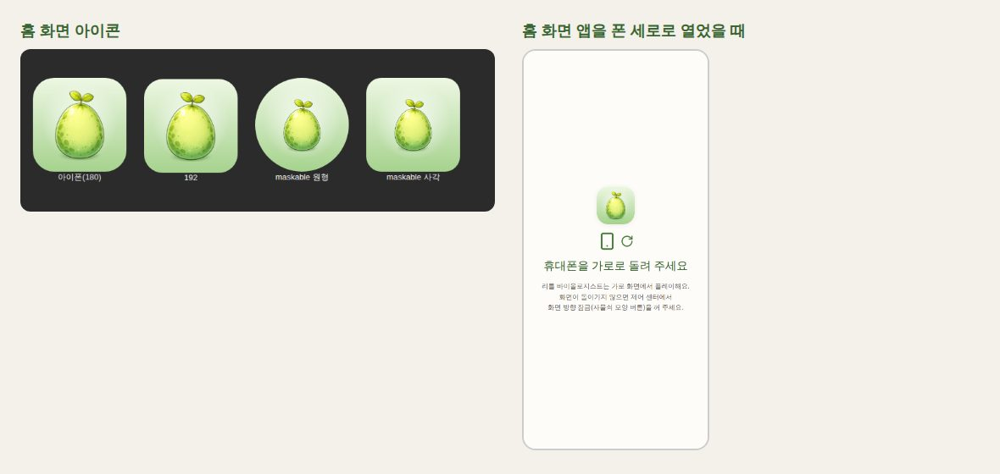

# 003. 아이폰에서 플레이: 홈 화면 웹 앱 + 첫 화면 버그 수정

- 날짜: 2026-10-04
- 분류: 플랫폼 확장
- 계기
  - 안드로이드 앱([001](001-web-to-android-app.md))을 만든 뒤, 사용자의 폰이 **아이폰(iOS)** 이라는 것을 알게 됐다.
  - 안드로이드 APK는 아이폰에 설치할 수 없어서, 아이폰에서 앱처럼 플레이할 방법이 필요했다.
- 관련 커밋: 이 기록과 같은 커밋 (feat: 아이폰 홈 화면 웹 앱 지원과 첫 화면 분기 수정)

## 1. 배경

- iOS 앱을 빌드하려면 **Mac과 Xcode 26 이상**이 꼭 필요하다(2026-04-28부터 App Store 업로드는 Xcode 26 이상).
- 개발 환경은 Windows다.
- 아이폰에 앱을 설치하는 방법은 세 가지뿐이다.
  - 무료 Apple ID: 내 기기에 7일 동안만 설치된다.
  - Apple Developer Program(연 99달러): TestFlight나 App Store로 배포한다.
  - 웹을 "홈 화면에 추가"하는 웹 앱
- iOS 26부터는 Safari에서 홈 화면에 추가한 사이트가 기본으로 **웹 앱**(주소창 없는 별도 창)으로 열린다.

## 2. 검토한 선택지와 결정

| 선택지 | 비용·준비물 | 장점 | 단점 |
|---|---|---|---|
| **홈 화면 웹 앱(PWA)** ✅ | 무료, Mac 불필요 | 지금 배포된 웹 그대로. 오늘 바로 가능 | 화면 방향 고정 불가(iOS 미지원), 앱스토어 등록 불가 |
| Capacitor iOS + 무료 Apple ID | Mac + Xcode | 진짜 앱. 안드로이드와 같은 코드 | Mac이 없으면 불가. 7일마다 다시 설치 |
| Capacitor iOS + 개발자 프로그램 + TestFlight | 연 99달러. Mac 대신 GitHub Actions(macOS) 가능 | 진짜 앱. 스토어 출시로 이어짐 | 비용, 인증서·프로비저닝 설정. TestFlight 빌드는 90일마다 갱신 |

**결정: 지금은 홈 화면 웹 앱으로 바로 플레이할 수 있게 한다.**

- 진짜 iOS 앱은 Mac이 있는지, 비용을 낼지 정한 뒤에 Capacitor iOS로 진행한다.
- 웹 앱용 작업(아이콘, 로그인 유지, 첫 화면 분기)은 나중에 iOS 앱을 만들 때도 그대로 쓰인다.

## 3. 구현

### 3-1. 홈 화면 웹 앱 설정

- **`public/manifest.webmanifest`**: 이름, 아이콘, `display: standalone`을 넣었다.
  - `orientation: landscape`도 넣었다. 안드로이드 Chrome은 이 값을 따르지만 iOS는 무시한다.
- **아이콘 4종**(`public/app-icons/`): 192, 512, 마스커블 512, 아이폰용 180.
  - 게임에서 처음 받는 "신비한 알" 원본(1024px)으로 만들었다.
  - 원본에서 알이 차지하는 영역을 계산해 크기를 맞췄다.
  - 마스커블 아이콘은 원형으로 잘려도 알이 보이도록 여백을 더 두었다.
- **`index.html`**: 매니페스트와 `apple-touch-icon`을 연결했다.
  - iOS용 메타 태그(`apple-mobile-web-app-*`)와 `theme-color`, 설명을 추가했다.

### 3-2. 홈 화면 웹 앱에서도 로그인 유지

- `isStandaloneWebApp`(`src/utils/platform.js`)을 추가했다.
  - iOS는 `navigator.standalone`으로, 그 밖의 브라우저는 `display-mode: standalone`으로 판정한다.
- 홈 화면 웹 앱은 브라우저 탭과 달리 "앱"처럼 닫고 연다. 그래서 앱(Capacitor)처럼 `localStorage`에 로그인을 저장한다.
- 출석 체크([001](001-web-to-android-app.md)의 4-3)는 그대로 함께 동작한다.

### 3-3. "가로로 돌려 주세요" 안내

- iOS는 웹 앱의 화면 방향을 고정할 수 없다.
  - 매니페스트의 `orientation`도, `screen.orientation.lock()`도 지원하지 않는다.
- 그래서 **홈 화면 웹 앱을 폰 세로로 열었을 때만** 화면 전체에 회전 안내를 띄운다(`RotateDeviceOverlay`).
  - 조건: 세로이면서 폭 600px 이하
  - 브라우저 탭과 태블릿에는 띄우지 않는다. 기존 웹 동작을 바꾸지 않기 위해서다.
  - 화면 방향 잠금이 켜져 있으면 회전이 안 되므로, 끄는 방법도 함께 안내한다.

### 3-4. 발견한 버그: 앱을 열면 항상 로그인 화면이 뜸

- `start_url`을 정하다가 발견했다.
- 원인
  - 앱(Capacitor)과 홈 화면 웹 앱은 **첫 주소 `/`** 에서 시작한다.
  - 그런데 `/`는 무조건 `/login`으로 보내고, 로그인 화면은 이미 로그인한 사용자를 목장으로 보내지 않는다.
- 결과: [001](001-web-to-android-app.md)에서 넣은 로그인 유지가 저장은 되는데, **앱을 열 때마다 로그인 화면이 떴다.**
- 001의 검증에서 이 문제를 놓친 이유: 새 탭에서 `/ranch`를 바로 열어 확인했다. 실제 앱이 시작하는 경로(`/`)를 쓰지 않았다.
- 수정: `RootRedirect`로 `/`를 로그인 상태에 따라 `/ranch` 또는 `/login`으로 나눈다.
  - 웹에서도 같은 탭에서 이미 로그인한 채 `/`로 오면 목장으로 간다.
  - 로그인하지 않은 새 탭은 기존처럼 로그인 화면으로 간다.

## 4. 검증

Playwright(Chromium)로 실제 빌드를 띄워 확인했다.
- 앱 모드: `window.androidBridge`를 흉내 냈다.
- 홈 화면 앱 모드: `navigator.standalone = true`로 흉내 냈다.

| 항목 | 결과 |
|---|---|
| 앱 모드, 로그인 유지 상태로 `/` 열기 | `/ranch`로 감 (수정 전에는 로그인 화면) |
| 홈 화면 앱 모드, 로그인 유지 상태로 `/` 열기 | `/ranch`로 감 |
| 웹, 로그인 안 한 새 탭으로 `/` 열기 | `/login` (기존과 동일) |
| 홈 화면 앱 모드에서 로그인 | `localStorage`에 저장, `sessionStorage`에는 없음 |
| 가로 안내 | 홈 화면 앱·폰 세로에서만 보임. 가로로 돌리면 사라짐. 홈 화면 앱·폰 가로, 브라우저 탭·폰 세로, 홈 화면 앱·태블릿 세로에서는 안 보임 |
| 매니페스트 | Chrome DevTools `Page.getAppManifest` 파싱 오류 0개, `Page.getInstallabilityErrors` 문제 없음 |
| 아이콘 | `apple-touch-icon.png`가 `image/png`로 제공됨. 원형·둥근 사각 마스크로 잘라 미리보기 확인 |
| 린트·빌드 | `eslint src server`, `vite build` 통과 |

## 5. 한계와 남은 일

- [ ] **실제 아이폰 확인**: 이 환경에는 Safari(WebKit)가 없어서 Chromium으로만 확인했다. 실기기에서 아래 항목을 확인해야 한다.
  - 홈 화면 추가
  - 아이콘
  - 카메라·사진 선택
  - 위치 권한
  - 소리
  - 세로 안내
- [ ] **배포 후에 적용됨**: 매니페스트·아이콘·로그인 유지는 이 변경이 Vercel 운영 주소(main)에 배포된 뒤부터 홈 화면 앱에 적용된다.
- [ ] **처음 한 번은 다시 로그인**: 홈 화면 웹 앱은 Safari와 저장 공간이 분리돼 있다. 그래서 홈 화면 앱에서 처음 한 번은 로그인해야 한다.
- [ ] **진짜 iOS 앱(Capacitor iOS)**: Mac 유무와 개발자 프로그램 가입 여부를 정한 뒤 진행한다.
  - Mac이 있으면 Xcode로 직접 설치한다.
  - Mac이 없으면 GitHub Actions(macOS) → TestFlight로 배포한다.
- [ ] **홈 이름 표시**: 홈 화면 아이콘 이름 "리틀 바이올로지스트"는 아이폰에서 길어서 잘릴 수 있다. 추가할 때 이름을 직접 바꿀 수 있다.

## 6. 포트폴리오 포인트

- 플랫폼 제약(iOS 빌드엔 Mac 필요, 배포엔 비용)을 비교해서 **오늘 바로 쓸 수 있는 방법(홈 화면 웹 앱)을 먼저** 선택했다. 진짜 앱으로 가는 길도 함께 정리해 두었다.
- iOS가 화면 방향 고정을 지원하지 않는 한계를 **회전 안내 UX**로 보완했다. 기존 웹 동작은 건드리지 않았다.
- 새 기능을 설계하다가 **이전 검증이 실제 앱 시작 경로를 빠뜨렸다는 것**을 찾아냈다. 버그를 고치고, 그 원인도 기록에 남겼다.
